# Controlling Remote Robots with Low Latency

I will show you how to enable over-the-internet communication between nodes in your ROS 2 system. 

You will learn:
- how to connect ROS 2 nodes running in different networks to a single ROS 2 system
- how to install, configure and use VPN client
- how to configure DDS to enable communication over VPN
- how to do everything above in the Docker to make your life easier

To focus purely on connectivity, not on running fancy ROS 2 software or robots in Gazebo, I will go through different scenarios based on a simple ROS 2 system containing of 3 nodes:

- `/turtlesim` - a very simple, simulator for learning ROS where you simulate ... a turtle :)
- `/move_controller` - node for controlling the movement of the turtle
- `/color_controller` - node that is changing the color of the line drawn by a turtle each second

The solution is scalable, so what you will learn can be applied in very complex distributed ROS 2 systems as well!

Our Goal:

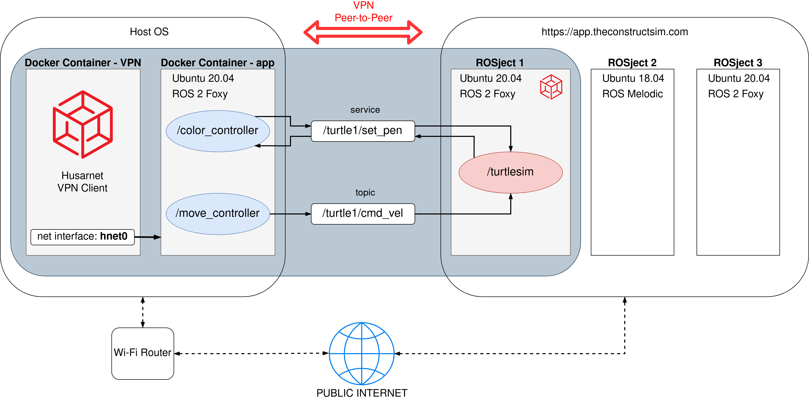


-------------
## Before you start Install Docker

Make sure you have Docker and Docker-Compose installed on your laptop. 

[The official instruction](https://docs.docker.com/get-docker/) is the best tutorial, but here's a quick rundown for you:

### Linux

```bash
sudo -E apt-get -y install apt-transport-https ca-certificates software-properties-common && \
curl -sL https://download.docker.com/linux/ubuntu/gpg | sudo apt-key add - && \
arch=$(dpkg --print-architecture) && \
sudo -E add-apt-repository "deb [arch=${arch}] https://download.docker.com/linux/ubuntu $(lsb_release -cs) stable" && \
sudo -E apt-get update && \
sudo -E apt-get -y install docker-ce docker-compose
```

```bash
sudo systemctl daemon-reload
sudo systemctl restart docker
```

### Windows

Here's a link for Windows Installer: https://docs.docker.com/docker-for-windows/install/

### MacOS

Here's a link for Windows Installer: https://docs.docker.com/docker-for-mac/install/

## [Eg. 1] Running the whole system in a single Docker container

**THIS EXAMPLE IS TO BE DONE ON YOUR LAPTOP**

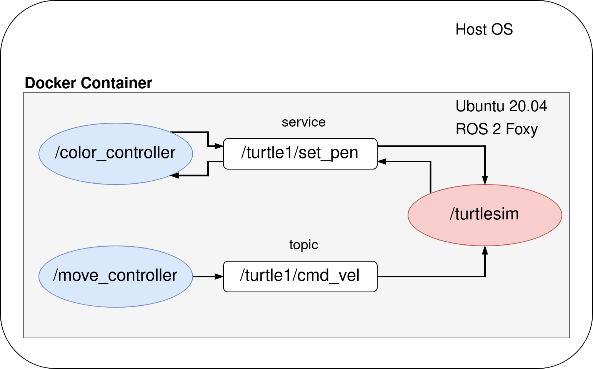

**Please stay in `ros2_docker_examples/` directory while executing those commands:**

```
sudo chmod +x eg1/init-container.sh
sudo chmod +x eg1/ros_entrypoint.sh

docker build -t turtle_demo -f eg1/Dockerfile .

xhost local:root

docker run --rm -it \
--env DISPLAY \
--volume /tmp/.X11-unix:/tmp/.X11-unix:rw \
turtle_demo
```

We start here within a single docker container all ROS 2 nodes here from a single launch file `rosdevday21-remote-robot/ros2_ws/my_turtle_bringup/turtlesim_demo.launch.py`.

Dockerfile is in `ros2_docker_examples/eg1` directory. You should see a turtle drawing a multi-color line:

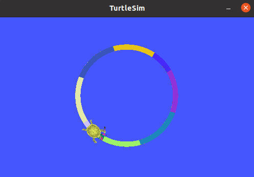

Congrats, let's make our system working accross a multiple Docker Containers in the next step.

## [Eg. 2] Let's do the same but in two containers

**THIS EXAMPLE IS TO BE DONE ON YOUR LAPTOP**

Basically that's wrong practise to run the whole app in the single container. The more elegant way is to divide your app into building blocks that could be updated or developed autonomously, even by different teams.

In our example we have basically two types of nodes, from two packages:
- `/turtlesim` - this node is provided by a third party and is a standard, pre-installed ROS package, so we can run it without even building our own container
- `/color_controller` and `/move_controller` are in created by us `my_demo_pkg`. Let's create our own, custom container to run only those two custom Nodes.

The target architecture is as follows:

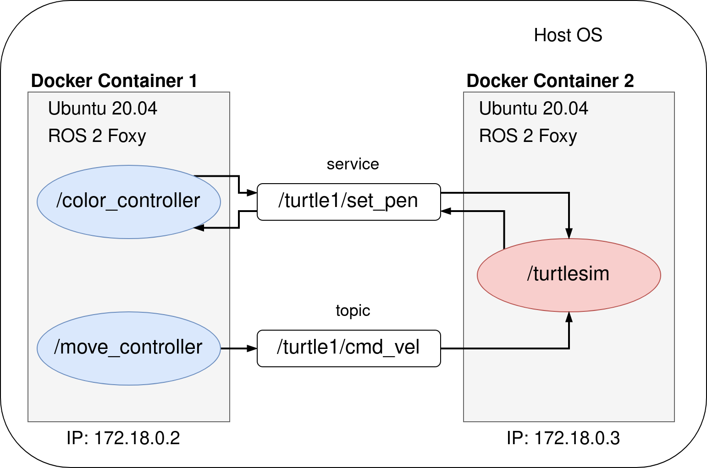

The multi-container setup, running on the same host can be described in a clean and elegant way in `docker-compose.yml`, so running this multicontainer system needs even less effort:

```bash
cd rosdevday21-remote-robot/eg2
docker-compose up
```

Result is the same:


Note that we do not need to care about autodiscovery, because DDS does it for us. Each running container automatically detects ROS 2 services, topics or actions from other running containers. 

The same situation would be if we run those nodes not in containers, but on hosts connected to the same Wi-Fi router. So nodes running on laptop and on your robot will detect each other if they are in the same LAN.

But what if we want to run the system accross multiple networks? Maybe we want to offload the robot and perform some computing on the remote server. In such a case DDS autodiscovery will not work without our help.

Let's go to the next section.

## [Eg. 3] PROBLEM: Running on two computers in different networks

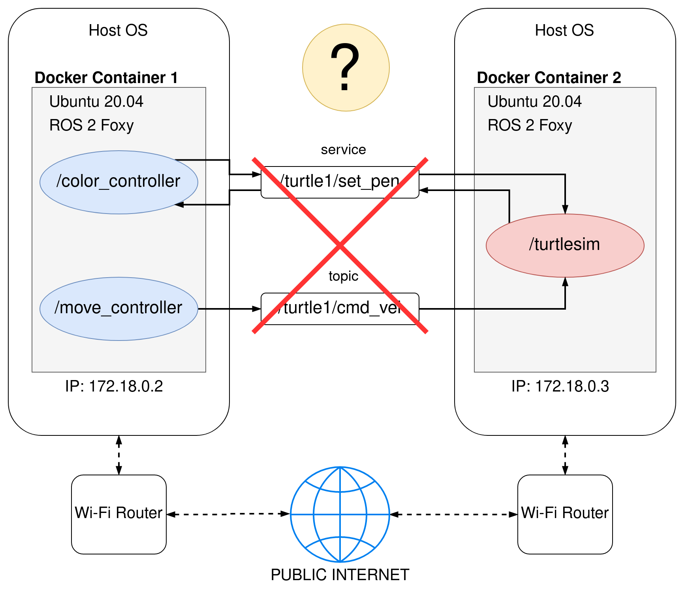

Because two ROS 2 devices are in different networks, DDS can not perform auto-discovery.

Also devices can not reach each other because they do not have neither public nor static IP addresses and are behind Wi-Fi router NAT.

The similar problem will be with connecting the container running on your laptop with this ROSject (that is basically a Virtaul Machine running on top of TheConstructSim server). You do not have access to the public IP of your VM - for the rest of world your ROSject runs on `52.84.197.70` (IP of https://app.theconstructsim.com).

To allow the container and ROSject see each other, we need to configure a VPN.

## [Eg. 3] SOLUTION: Connecting container on your laptop with turtlesim in the ROSject

To enable communication between ROS 2 containers running on your laptops wiht a turtlesim running in the ROS DS we need to do:

a) In the ROSject:
- install & configure Husarnet VPN client
- create a custom DDS confiugration file
- run the turtlesime

b) On your laptop:
- paste Husarnet JoinCode to the `eg3/.env` file.

After we finish the system will look like this:


### I. Create a Husarnet Network

#### 1. Register a free account at https://app.husarnet.com

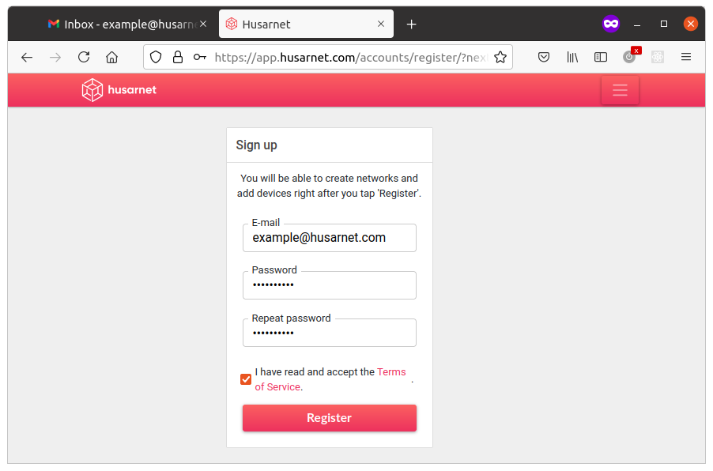

#### 2. Confirm your e-mail

After you click "Register" you will be redirected to your account and see that:

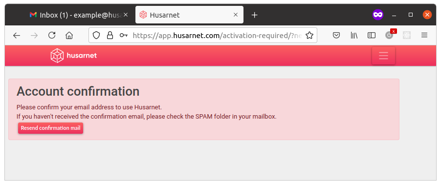

Please click the confirmation link in the e-mail you should have just received:

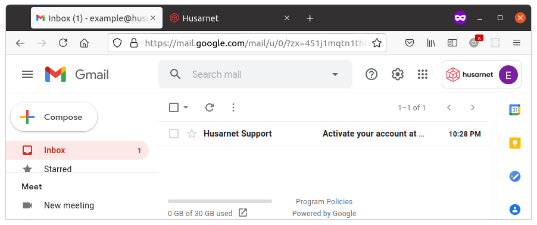

#### 2. Create your first Husarnet Network

After you click the confirmation e-mail you will see your account with no networks:

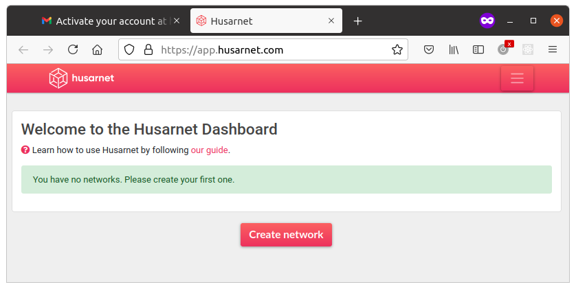

Click a **[Create network]** button and name your first network, eg. `my_network`:

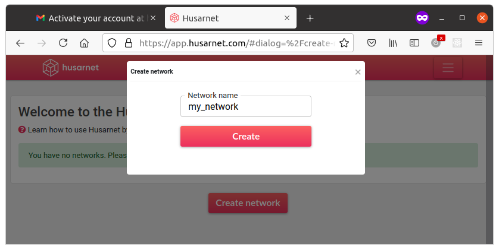

#### 3. Find the Join Code for the Husarnet network you just have created

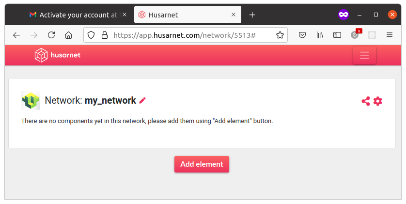

Click **[Add element]** button and you will see a window with your Join Code:

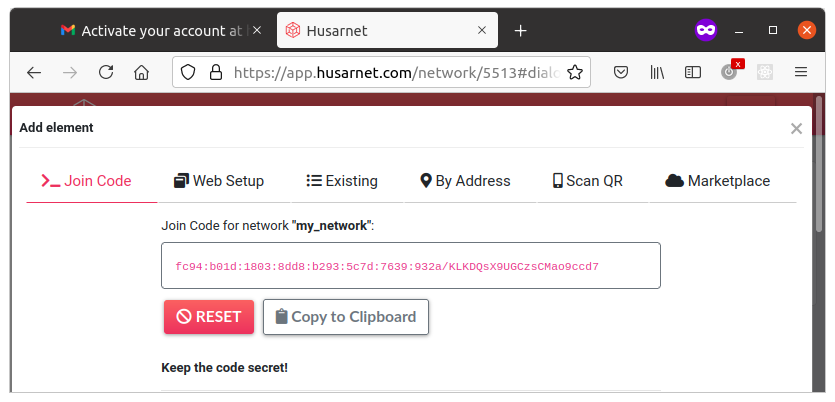

In our example: 
```
fc94:b01d:1803:8dd8:b293:5c7d:7639:932a/KLKDQsX9UGCzsCMao9ccd7
```
Save it for next steps.

## II. Start a container on your laptop


### Connecting containers to the same VPN network


You will find your Join Code at **https://app.husarnet.com  
 -> Click on the desired network  
 -> `Add element` button  
 -> `Join Code` tab** 

Then go to `eg3/dev1/` folder on first machine, and `eg3/dev2` folder on second machine and execute:

```bash
docker-compose up
```

You will see the following output log:

```bash
dominik@legion-y540:~/tech/ros2_docker_examples/eg3/dev1$ docker-compose up
Starting dev1_turtle_controller_1 ... done
Attaching to dev1_turtle_controller_1
turtle_controller_1  | 
turtle_controller_1  | ⏳ [1/2] Initializing Husarnet Client:
turtle_controller_1  | waiting...
turtle_controller_1  | waiting...
turtle_controller_1  | waiting...
turtle_controller_1  | success
turtle_controller_1  | 
turtle_controller_1  | 🔥 [2/2] Connecting to Husarnet network as "turtle-controller":
turtle_controller_1  | [2216368] joining...
turtle_controller_1  | [2218369] joining...
turtle_controller_1  | done
turtle_controller_1  | 
turtle_controller_1  | *******************************************
turtle_controller_1  | 💡 Tip
turtle_controller_1  | IPv6 addr of this container is: fc94:a2cd:168a:1c7b:a135:e22f:e172:892f
turtle_controller_1  | *******************************************
```

It will contain a IPv6 address of the device (like `fc94:a2cd:168a:1c7b:a135:e22f:e172:892f` from the log above). You will use that address to configure a Cyclone DDS in the next step.

You can shutdown the container now by clicking **[ctrl + c]**

### Configuring a Cyclone DDS

In `cyclonedds.xml` file we need to specify a Husarnet VPN IPv6 address of all peers. So in `eg3/dev1/cyclonedds.xml` file you need to specify IPv6 addres of `dev1` device:

```xml
<Peers>
    <Peer address="[fc94:c37a:c18e:bc90:9b0b:7144:f212:9743]"/>
</Peers>
```

Similarly modify `eg3/dev2/cyclonedds.xml` by specifying Husarnet IPv6 addr of `dev1` there.

### Running the containers:

Now go to `eg3/dev1/` and `eg3/dev2/` folders on two machines and run:

```bash
xhost local:root # remember about this line on dev2

cd eg3/dev2
docker-compose build
docker-compose up
```

Congrats! You have everything up and running.


## [Eg. 3] SOLUTION 2: Connecting container on your laptop with turtlesim in the ROSject


### TO DO on your laptop

```bash
cd eg3/dev1
docker-compose build
docker-compose up
```

and copy the container's Husarnet IPv6 address from an output log (or from a app.husarnet.com)

### TO DO in the ROSject

Create a new ROSject and run:

#### Terminal 1

```bash
sudo husarnet daemon
```

#### Terminal 2

##### 1. Connecting your ROSject to the Husarnet network:

```bash
sudo husarnet join <joincode> rosject1
```

Copy your ROSject's Husarnet IPv6 address to this part of `eg3/dev1/cyclonedds.xml` file:

```xml
<Peers>
    <Peer address="[fc94:c37a:c18e:bc90:9b0b:7144:f212:9743]"/>
</Peers>
```

##### 2. Installing and configuring Cyclone DDS

```
sudo apt update
sudo apt install ros-foxy-rmw-cyclonedds-cpp
cd ~
touch cyclonedds.xml
```

Copy the following XML to the `cyclonedds.xml` (in the ROSject):

```xml
<?xml version="1.0" encoding="UTF-8" ?>
<CycloneDDS xmlns="https://cdds.io/config" xmlns:xsi="http://www.w3.org/2001/XMLSchema-instance" xsi:schemaLocation="https://cdds.io/config https://raw.githubusercontent.com/eclipse-cyclonedds/cyclonedds/master/etc/cyclonedds.xsd">
    <Domain id="any">
        <General>
            <NetworkInterfaceAddress>auto</NetworkInterfaceAddress>
            <AllowMulticast>false</AllowMulticast>
            <MaxMessageSize>65500B</MaxMessageSize>
            <FragmentSize>4000B</FragmentSize>
            <Transport>udp6</Transport>
        </General>      
        <Discovery>
            <Peers>
                <Peer address="[fc94:f6ad:cabc:a059:2050:9b3b:7a7f:7524]"/>
            </Peers>
            <ParticipantIndex>auto</ParticipantIndex>
        </Discovery>
        <Internal>
            <Watermarks>
                <WhcHigh>500kB</WhcHigh>
            </Watermarks>
        </Internal>
        <Tracing>
            <Verbosity>severe</Verbosity>
            <OutputFile>stdout</OutputFile>
        </Tracing>
    </Domain>
</CycloneDDS>
```

In this line place the IPv6 address of the running container from your laptop.

```xml
<Peer address="[fc94:f6ad:cabc:a059:2050:9b3b:7a7f:7524]"/>
```

Save file and execute in the terminal:

```bash
source /opt/ros/foxy/setup.bash
export RMW_IMPLEMENTATION=rmw_cyclonedds_cpp
export CYCLONEDDS_URI=file:///home/user/cyclonedds.xml
```

##### 3. Running the turtlesim node

```bash
ros2 run turtlesim turtlesim_node
```

and on your laptop start the container:

```bash
cd eg3/dev1
docker-compose build
docker-compose run
```

In the ROSject (after you click `[Graphical tools]` button ) you will see:


## [Eg. 4] Using a separate VPN container

Instead of modyfing your own containers, you can launch a separate official [Husarnet VPN container](https://hub.docker.com/r/husarnet/husarnet) next to your existing app container.

`hnet0` network interface from Husarnet container is shared with any container you specify in the `docker-compose.yml`. Thanks to that without modyfying your exisitng container with ROS 2 nodes, you can connect them with remote nodes without any effor.

Moreover instead of long IPv6 addresses you can use Husarnet hostnames of the Husarnet Container (specified in `eg4/dev*/.env` files).


That's a truely zero effort solution that simply works.

TL;DR:

### DEVICE 1

Clone this repo to the first device, then execute in the terminal:

```bash
cd ros2_docker_examples/eg4/dev1

# Add your own join code to the .env file in the current directory.
# Example .env file content:
#
# JOINCODE=fc94:b01d:1803:8dd8:b293:5c7d:7639:932a/tTZtwiqM59iXtnCWABUEKH
# HOSTNAME=turtle-controller-1

docker-compose up
```

### DEVICE 2

Clone this repo to the second device, then execute in the terminal:

```bash
cd ros2_docker_examples/eg4/dev2

# Add your own join code to the .env file in the current directory.
# Example .env file content:
#
# JOINCODE=fc94:b01d:1803:8dd8:b293:5c7d:7639:932a/tTZtwiqM59iXtnCWABUEKH
# HOSTNAME=turtlesim-1

docker-compose up
```

### Result:


Note that we haven't modified `cyclonedds.xml` file, because we specified there hostnames of Husarnet containers (in `.env` file) insted of IPv6 address.