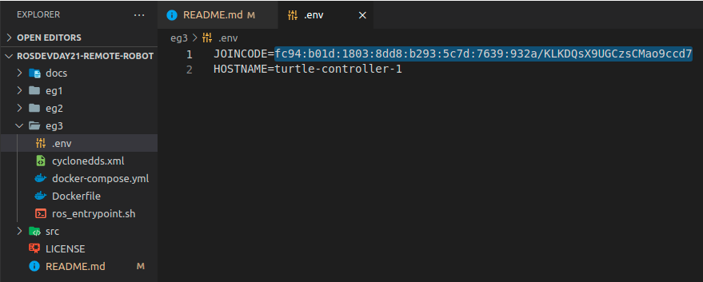
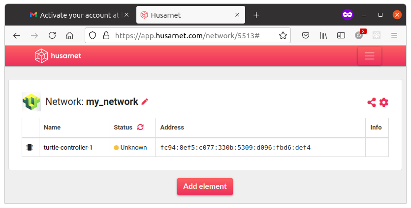
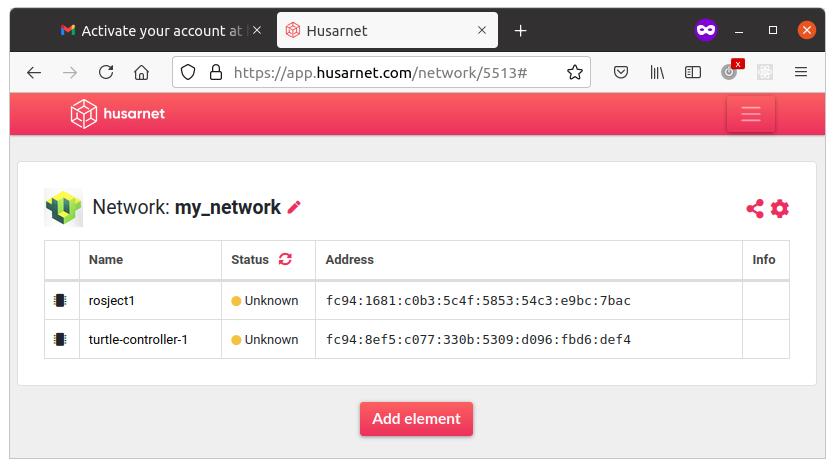
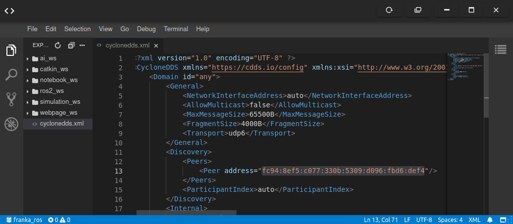
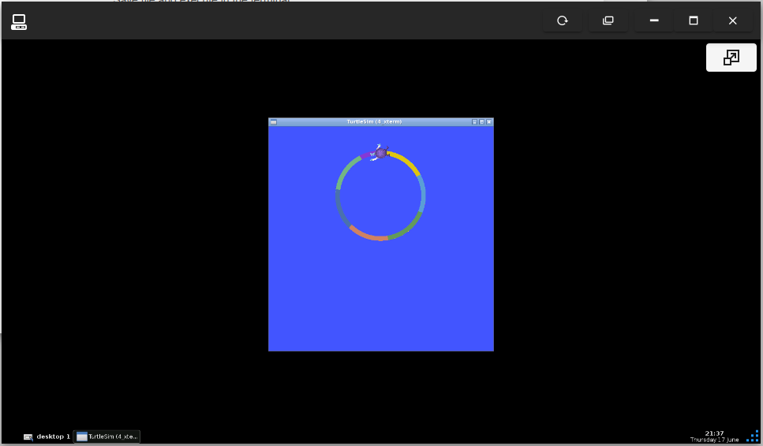

# Controlling Remote Robots with Low Latency

I will show you how to enable over-the-internet communication between nodes in your ROS 2 system. 

You will learn:
- how to connect ROS 2 nodes running in different networks to a single ROS 2 system
- how to install, configure and use VPN client
- how to configure DDS to enable communication over VPN
- how to do everything above in the Docker to make your life easier

To focus purely on connectivity, not on running fancy ROS 2 software or robots in Gazebo, I will go through different scenarios based on a simple ROS 2 system containing of 3 nodes:

- `/turtlesim` - a very simple, simulator for learning ROS where you simulate ... a turtle :)
- `/move_controller` - node for controlling the movement of the turtle
- `/color_controller` - node that is changing the color of the line drawn by a turtle each second

The solution is scalable, so what you will learn can be applied in very complex distributed ROS 2 systems as well!

Our Goal:


-------------
## Before you start Install Docker

Make sure you have Docker and Docker-Compose installed on your laptop. 

[The official instruction](https://docs.docker.com/get-docker/) is the best tutorial, but here's a quick rundown for you:

### Linux

```bash
sudo -E apt-get -y install apt-transport-https ca-certificates software-properties-common && \
curl -sL https://download.docker.com/linux/ubuntu/gpg | sudo apt-key add - && \
arch=$(dpkg --print-architecture) && \
sudo -E add-apt-repository "deb [arch=${arch}] https://download.docker.com/linux/ubuntu $(lsb_release -cs) stable" && \
sudo -E apt-get update && \
sudo -E apt-get -y install docker-ce docker-compose
```

```bash
sudo systemctl daemon-reload
sudo systemctl restart docker
```

### Windows

Here's a link for Windows Installer: https://docs.docker.com/docker-for-windows/install/

### MacOS

Here's a link for Windows Installer: https://docs.docker.com/docker-for-mac/install/

## [Eg. 1] Running the whole system in a single Docker container

**THIS EXAMPLE IS TO BE DONE ON YOUR LAPTOP**


**Please stay in `ros2_docker_examples/` directory while executing those commands:**

```
sudo chmod +x eg1/init-container.sh
sudo chmod +x eg1/ros_entrypoint.sh

docker build -t turtle_demo -f eg1/Dockerfile .

xhost local:root

docker run --rm -it \
--env DISPLAY \
--volume /tmp/.X11-unix:/tmp/.X11-unix:rw \
turtle_demo
```

We start here within a single docker container all ROS 2 nodes here from a single launch file `rosdevday21-remote-robot/ros2_ws/my_turtle_bringup/turtlesim_demo.launch.py`.

Dockerfile is in `ros2_docker_examples/eg1` directory. You should see a turtle drawing a multi-color line:


Congrats, let's make our system working accross a multiple Docker Containers in the next step.

## [Eg. 2] Let's do the same but in two containers

**THIS EXAMPLE IS TO BE DONE ON YOUR LAPTOP**

Basically that's wrong practise to run the whole app in the single container. The more elegant way is to divide your app into building blocks that could be updated or developed autonomously, even by different teams.

In our example we have basically two types of nodes, from two packages:
- `/turtlesim` - this node is provided by a third party and is a standard, pre-installed ROS package, so we can run it without even building our own container
- `/color_controller` and `/move_controller` are in created by us `my_demo_pkg`. Let's create our own, custom container to run only those two custom Nodes.

The target architecture is as follows:


The multi-container setup, running on the same host can be described in a clean and elegant way in `docker-compose.yml`, so running this multicontainer system needs even less effort:

```bash
cd rosdevday21-remote-robot/eg2
docker-compose up
```

Result is the same:


Note that we do not need to care about autodiscovery, because DDS does it for us. Each running container automatically detects ROS 2 services, topics or actions from other running containers. 

The same situation would be if we run those nodes not in containers, but on hosts connected to the same Wi-Fi router. So nodes running on laptop and on your robot will detect each other if they are in the same LAN.

But what if we want to run the system accross multiple networks? Maybe we want to offload the robot and perform some computing on the remote server. In such a case DDS autodiscovery will not work without our help.

Let's go to the next section.

## [Eg. 3] PROBLEM: Running on two computers in different networks


Because two ROS 2 devices are in different networks, DDS can not perform auto-discovery.

Also devices can not reach each other because they do not have neither public nor static IP addresses and are behind Wi-Fi router NAT.

The similar problem will be with connecting the container running on your laptop with this ROSject (that is basically a Virtaul Machine running on top of TheConstructSim server). You do not have access to the public IP of your VM - for the rest of world your ROSject runs on `52.84.197.70` (IP of https://app.theconstructsim.com).

To allow the container and ROSject see each other, we need to configure a VPN.

## [Eg. 3] SOLUTION: Connecting container on your laptop with turtlesim in the ROSject

To enable communication between ROS 2 containers running on your laptops with a turtlesim running in the ROS DS we need to do:

a) In the ROSject:
- install & configure Husarnet VPN client
- create a custom DDS confiugration file
- run the turtlesime

b) On your laptop:
- paste Husarnet JoinCode to the `eg3/.env` file.

After we finish the system will look like this:


### I. Create a Husarnet Network

#### 1. Create a free account at https://app.husarnet.com


#### 2. Confirm your e-mail

After you click "Register" you will be redirected to your account where your will see:


Please click the confirmation link in the e-mail you should have just received:


#### 2. Create your first Husarnet Network

After you click the confirmation e-mail you will see your account with no networks:


Click a **[Create network]** button and name your first network, eg. `my_network`:


#### 3. Find the Join Code for the Husarnet network you just have created


Click **[Add element]** button and you will see a window with your Join Code:


In our example **the Join Code is**: 
```
fc94:b01d:1803:8dd8:b293:5c7d:7639:932a/KLKDQsX9UGCzsCMao9ccd7
```
Save it for next steps.

## II. Start a container on your laptop

Navigate to `rosdevday21-remote-robot/eg3` folder and edit `.env` file sitting there:



Place the Join Code from a previous step here (remember to use your own Join Code!).

Now you can just start a container:

```bash
cd rosdevday21-remote-robot/eg3
sudo docker-compose up --build
```

after that you should see a log like this:

```bash
Building turtle_controller
Step 1/11 : FROM osrf/ros:foxy-desktop
 ---> a92cfa2aad6c
Step 2/11 : SHELL ["/bin/bash", "-c"]
 ---> Using cache
 ---> 44c76e108fc6

...

Step 11/11 : CMD ["bash"]
 ---> Running in 855ac5c10ae5
Removing intermediate container 855ac5c10ae5
 ---> 5333e9d8d9a8

Successfully built 5333e9d8d9a8
Successfully tagged eg3_turtle_controller:latest
Creating eg3_turtle_controller_1 ... done
Creating eg3_husarnet_1          ... done
Attaching to eg3_turtle_controller_1, eg3_husarnet_1
husarnet_1           | Waiting for the husarnet daemon to start
turtle_controller_1  | [INFO] [launch]: All log files can be found below /root/.ros/log/2021-06-17-20-58-46-802846-13cf6b024429-1
turtle_controller_1  | [INFO] [launch]: Default logging verbosity is set to INFO

...

husarnet_1           | [105449624] joining...

...

turtle_controller_1  | [color_controller-2] [WARN] [1623963537.195861386] [color_controller]: Waiting for server Set Pen....
husarnet_1           | Husarnet IP address: fc94:8ef5:c077:330b:5309:d096:fbd6:def4
```

Husarnet Client started by Docker Compose has been configured with the following IPv6 address: `fc94:8ef5:c077:330b:5309:d096:fbd6:def4`

Your container should also be now available on your Husarnet Dashboard account:




### III. Connect your ROSject to the same Husarnet network

#### 1. Start Husarnet Daemon

In this ROSject Husarnet VPN Client is pre-installed. Systemd is not enabled in the ROSjects, so you need to open a new terminal window and start Husarnet Daemon manually:

```bash
sudo husarnet daemon
```

#### 2. Connect your ROSject to the Husarnet network

To connect this ROSject to the same Husarnet network as the containers from a previous step just use `husarnet join` command with your own Join Code:

```bash
sudo husarnet join fc94:b01d:1803:8dd8:b293:5c7d:7639:932a/KLKDQsX9UGCzsCMao9ccd7 rosject1
```

> Please use `rosject1` hostname here - it is used in the container running on your laptop DDS configuration by default

Now when you refresh your Husarnet Dashboard window you should see the second device in your network:



#### 3. Configure a Cyclone DDS

> In this ROSject Cyclone DDS RMW is pre-installed. You can configure FastDDS in a similar way.

Open a Code Editor in the ROSject and edit `cyclonedds.xml` file:



Please place IPv6 address of the `turtle-controller-1` device. 

In this example it's `fc94:8ef5:c077:330b:5309:d096:fbd6:def4` and save a file.

#### 4. Run a turtlesim

Execute the following lines in the terminal window inside this ROSject:

```bash
source /opt/ros/foxy/setup.bash
export RMW_IMPLEMENTATION=rmw_cyclonedds_cpp
export CYCLONEDDS_URI=file:///home/user/cyclonedds.xml

ros2 run turtlesim turtlesim_node
```

Now open Graphical Tools in the ROSject and you will see the same turtle as in the previous examples, but this time running in your ROSject:



## Well Done!

I hope you will find this tutorial useful. You learned how to connect your ROS 2 Nodes across computers in different networks.

If you will have any further questions, maybe you will find the answer under those links:
- https://husarnet.com/docs/manual-general
- https://husarnet.com/blog
- https://husarnet.com/docs/tutorial-ros1
- https://husarnet.com/docs/tutorial-ros2